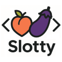
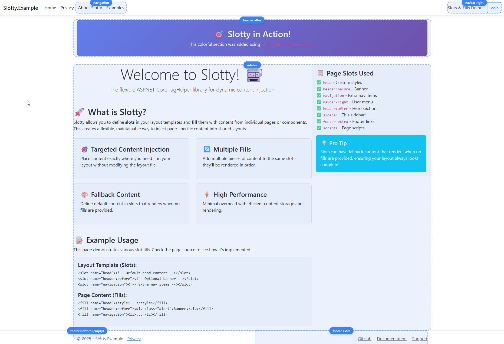

# 🎯 Slotty

<div align="center">



**A modern, flexible content slot system for ASP.NET Core that replaces the limitations of `@RenderSection`**

[](https://www.nuget.org/packages/Slotty)
[](https://www.nuget.org/packages/Slotty)
[](https://github.com/AaronLayton/slotty/actions)
[](LICENSE)
[](https://dotnet.microsoft.com)

</div>

---

## 🚀 Why Slotty?

Tired of the rigid, error-prone `@RenderSection` system? **Slotty** brings modern content management to ASP.NET Core with a flexible, component-based approach that enables **true component distribution**.

### The Problem with `@RenderSection`

```csharp
// ❌ Old way: Rigid, error-prone, limited
@RenderSection("Scripts", required: false)
@RenderSection("Styles", required: false)

// Must define sections in exact layout hierarchy
// No dynamic content injection
// Poor error handling
// Can't distribute layouts via NuGet packages
// Limited extensibility
```

### The Slotty Solution

```html
<!-- ✅ New way: Flexible, powerful, distributable -->
<slot name="head"></slot>
<slot name="nav-primary"></slot>
<slot name="scripts"></slot>

<!-- Multiple content blocks, extensions, fallbacks -->
<slot name="sidebar">
    <div>Default sidebar content</div>
</slot>

<!-- Perfect for NuGet package distribution -->
<!-- Themes, plugins, and components that consumers can extend -->
```

**🎯 Game Changer**: Ship complete admin themes, component libraries, and plugins as NuGet packages that consuming applications can customize and extend!

## ✨ Features

- 🎯 **Multiple Content Sources** - Add content to slots from anywhere in your application
- 🔧 **Slot Extensions** - Automatic `:before` and `:after` extension points
- 🛡️ **Type Safety** - Built-in validation with helpful error messages
- 🎨 **Development Tools** - Visual slot debugging with `Alt+S` keyboard shortcut
- 📦 **NuGet Distribution** - Ship themes and components as distributable packages
- 🚀 **High Performance** - Request-scoped content management
- 🔄 **Backward Compatible** - Migrate gradually from `@RenderSection`

## 📋 Table of Contents

- [Installation](#-installation)
- [Quick Start](#-quick-start)
- [Configuration](#-configuration)
- [Basic Usage](#-basic-usage)
- [Advanced Examples](#-advanced-examples)
- [Development Tools](#-development-tools)
- [Migration Guide](#-migration-guide)
- [API Reference](#-api-reference)
- [Contributing](#-contributing)

## 📦 Installation

### Package Manager Console
```powershell
Install-Package Slotty
```

### .NET CLI
```bash
dotnet add package Slotty
```

### PackageReference
```xml
<PackageReference Include="Slotty" Version="1.1.0" />
```

## ⚡ Quick Start

### 1. Register Services

```csharp
// Program.cs
builder.Services.AddSlotty();
app.UseSlotty(); // For automatic dev tools injection
```

### 2. Define Slots in Layout

```html
<!-- Views/Shared/_Layout.cshtml -->
<!DOCTYPE html>
<html>
<head>
    <slot name="head">
        <!-- Fallback content -->
        <title>Default Title</title>
    </slot>
</head>
<body>
    <header>
        <slot name="header"></slot>
    </header>
    
    <main>
        @RenderBody()
    </main>
    
    <slot name="scripts"></slot>
</body>
</html>
```

### 3. Fill Slots from Views

```html
<!-- Views/Home/Index.cshtml -->
<fill slot="head">
    <title>Home Page</title>
    <meta name="description" content="Welcome to our site">
</fill>

<fill slot="header">
    <nav>Navigation content</nav>
</fill>

<h1>Welcome!</h1>

<fill slot="scripts">
    <script src="~/js/home.js"></script>
</fill>
```

## ⚙️ Configuration

### Basic Configuration

```csharp
// Use default settings (recommended)
builder.Services.AddSlotty();
```

### Advanced Configuration

```csharp
// Program.cs - Programmatic configuration
builder.Services.AddSlotty(options =>
{
    options.ValidationMode = SlottyValidationMode.Log; // Silent, Log, Throw
    options.DevToolsInjection = SlottyDevToolsInjectionMode.Auto; // Auto, Always, Never
});
```

### Configuration via appsettings.json

```json
{
  "Slotty": {
    "ValidationMode": "Log",
    "DevToolsInjection": "Auto"
  }
}
```

```csharp
// Program.cs
builder.Services.AddSlotty(builder.Configuration.GetSection("Slotty"));
```

### Validation Modes

| Mode | Description | Use Case |
|------|-------------|----------|
| `Silent` | Basic slot name validation only | Production environments |
| `Log` | Validation with warning logs | Staging/testing environments |
| `Throw` | Strict validation with exceptions | Development environments |

## 📖 Basic Usage

### Simple Slots

```html
<!-- Define a slot -->
<slot name="sidebar"></slot>

<!-- Fill the slot -->
<fill slot="sidebar">
    <div class="widget">Content here</div>
</fill>
```

### Slots with Fallbacks

```html
<!-- Slot with default content -->
<slot name="breadcrumbs">
    <nav>
        <a href="/">Home</a>
    </nav>
</slot>

<!-- Override when needed -->
<fill slot="breadcrumbs">
    <nav>
        <a href="/">Home</a> > 
        <a href="/products">Products</a> > 
        <span>iPhone</span>
    </nav>
</fill>
```

### Multiple Content Blocks

```html
<!-- Multiple fills for the same slot -->
<fill slot="styles">
    <link rel="stylesheet" href="~/css/components.css">
</fill>

<fill slot="styles">
    <link rel="stylesheet" href="~/css/page-specific.css">
</fill>

<!-- Both stylesheets will be rendered -->
<slot name="styles"></slot>
```

### Slot Extensions

Every slot automatically gets `:before` and `:after` extension points:

```html
<!-- Layout -->
<slot name="content"></slot>

<!-- Page fills -->
<fill slot="content:before">
    <div class="alert">Important notice!</div>
</fill>

<fill slot="content">
    <h1>Main Content</h1>
</fill>

<fill slot="content:after">
    <div class="related-links">Related: ...</div>
</fill>
```

## 🔥 Advanced Examples

### 📦 Distributable NuGet Themes & Plugins

One of Slotty's most powerful features is enabling **component distribution via NuGet packages**. Ship complete layouts, themes, and plugins that consuming applications can extend and customize.

#### Admin Theme NuGet Package

Create a reusable admin theme package:

```html
<!-- AdminTheme.Web/Views/Shared/_AdminLayout.cshtml -->
<!DOCTYPE html>
<html>
<head>
    <slot name="head">
        <title>Admin Dashboard</title>
        <link rel="stylesheet" href="~/css/admin-theme.css">
    </slot>
</head>
<body class="admin-layout">
    <header class="admin-header">
        <slot name="header">
            <h1>Admin Portal</h1>
        </slot>
        <slot name="user-menu"></slot>
    </header>
    
    <div class="admin-container">
        <aside class="admin-sidebar">
            <nav class="admin-nav">
                <slot name="navigation:before"></slot>

                <!-- Core navigation -->
                <a href="/admin" class="nav-item">
                    <i class="icon-dashboard"></i> Dashboard
                </a>
                <a href="/admin/users" class="nav-item">
                    <i class="icon-users"></i> Users
                </a>
                
                <!-- Plugin injection points -->
                <slot name="navigation-menu"></slot>
                
                <div class="nav-sticky-bottom">
                    <!-- Plugin injection points -->
                    <slot name="navigation-footer"></slot>

                    <a href="/admin/logout" class="nav-item">
                        <i class="icon-logout"></i> Logout
                    </a>
                </div>
            </nav>
        </aside>
        
        <main class="admin-main">
            <slot name="breadcrumbs"></slot>
            <slot name="page-header"></slot>
            
            @RenderBody()
            
            <slot name="page-footer"></slot>
        </main>
    </div>
    
    <slot name="modals"></slot>
    <slot name="scripts"></slot>
</body>
</html>
```

#### Client Application Usage

Install and use the admin theme:

```bash
# Client application installs the theme
dotnet add package MyCompany.AdminTheme
```

```html
<!-- Views/Admin/Index.cshtml -->
@{
    Layout = "_AdminLayout"; // From NuGet package
}

<fill slot="head">
    <title>Dashboard - My App Admin</title>
    <link rel="stylesheet" href="~/css/custom-admin.css">
</fill>

<fill slot="user-menu">
    <div class="user-dropdown">
        <span>Welcome, @User.Identity.Name</span>
        <a href="/logout">Logout</a>
    </div>
</fill>

<fill slot="breadcrumbs">
    <nav>Home > Dashboard</nav>
</fill>

<!-- Main dashboard content -->
<div class="dashboard">
    <h1>Dashboard</h1>
    <!-- Dashboard widgets -->
</div>
```

#### Plugin NuGet Packages

Create plugins that extend the admin theme:

```html
<!-- InventoryPlugin/Views/Shared/_InventoryNavigation.cshtml -->
@{
    // This partial is included by the plugin
}

<fill slot="nav-primary">
    <div class="nav-section">
        <span class="nav-section-title">Inventory</span>
        <a href="/admin/products" class="nav-item">
            <i class="icon-box"></i> Products
        </a>
        <a href="/admin/categories" class="nav-item">
            <i class="icon-tags"></i> Categories
        </a>
        <a href="/admin/inventory" class="nav-item">
            <i class="icon-warehouse"></i> Stock Levels
        </a>
    </div>
</fill>
```

```html
<!-- ReportsPlugin/Views/Shared/_ReportsNavigation.cshtml -->
<fill slot="nav-secondary">
    <div class="nav-section">
        <span class="nav-section-title">Reports</span>
        <a href="/admin/reports/sales" class="nav-item">
            <i class="icon-chart"></i> Sales Reports
        </a>
        <a href="/admin/reports/analytics" class="nav-item">
            <i class="icon-analytics"></i> Analytics
        </a>
    </div>
</fill>
```

#### Client Application Integration

The client app includes navigation from all installed plugins:

```html
<!-- Views/Shared/_ViewImports.cshtml -->
@using MyCompany.AdminTheme
@addTagHelper *, MyCompany.AdminTheme

<!-- Include plugin navigations -->
@Html.Partial("~/Views/Shared/_InventoryNavigation.cshtml") 
@Html.Partial("~/Views/Shared/_ReportsNavigation.cshtml")
```

#### Benefits of This Architecture

✅ **Modular Development**: Teams can work on separate plugins independently  
✅ **Consistent UI**: All plugins use the same admin theme  
✅ **Easy Installation**: `dotnet add package InventoryPlugin`  
✅ **Customizable**: Client apps can override any slot with their own content  
✅ **Maintainable**: Theme updates automatically benefit all plugins  

### E-commerce Product Pages

```html
<!-- Views/Products/Details.cshtml -->
<fill slot="head">
    <title>@Model.Name - My Store</title>
    <meta name="description" content="@Model.Description">
</fill>

<fill slot="breadcrumbs">
    <nav>
        <a href="/">Home</a> > 
        <a href="/products">Products</a> > 
        @Model.Category.Name
    </nav>
</fill>

<!-- Main product content -->
<div class="product-details">
    <h1>@Model.Name</h1>
    <div class="price">$@Model.Price</div>
</div>

<fill slot="page-footer">
    <section class="related-products">
        <h2>You Might Also Like</h2>
        <!-- Related products -->
    </section>
</fill>

<fill slot="scripts">
    <script src="~/js/product-gallery.js"></script>
</fill>
```

### Component Libraries with Slots

```html
<!-- _ProductCard.cshtml - Distributable component -->
<div class="product-card">
    <slot name="product-image">
        
    </slot>
    
    <div class="product-info">
        <h3>@Model.Name</h3>
        <div class="price">$@Model.Price</div>
        
        <slot name="product-actions">
            <button class="btn btn-primary">Add to Cart</button>
        </slot>
    </div>
    
    <slot name="product-badges"></slot>
</div>

<!-- Usage with customization -->
@Html.Partial("_ProductCard", product)

<fill slot="product-badges">
    @if (product.IsOnSale)
    {
        <span class="badge sale">50% OFF</span>
    }
</fill>

<fill slot="product-actions">
    <button class="btn btn-primary" data-product="@product.Id">
        Quick Add - $@product.Price
    </button>
    <a href="#" class="wishlist-btn">♡ Save</a>
</fill>
```

## 🛠️ Development Tools

### Visual Slot Debugging

Slotty includes powerful development tools that make slot debugging intuitive and visual:


*Placeholder image - Visual overlay showing slot boundaries and names*

### Interactive Overlay System

**Keyboard Shortcut: `Alt + S`**

- **Single press**: Show slot overlays while keys are held
- **Double press**: Toggle permanent visibility (persists until page reload)
- **Visual indicators**: Each slot shows its name, content status, and boundaries

```html
<!-- Automatically injected in development -->
<script>
// Alt+S keyboard shortcut for slot visualization
// Double-press for permanent visibility
// Session storage persistence
</script>
```

### Customizable Overlay Styling

Override the default blue theme with CSS variables:

```css
/* Change the entire overlay theme with one variable */
:root {
  --slotty-overlay-color: red;                    /* Base color */
  --slotty-overlay-transition-duration: 300ms;    /* Animation speed */
  --slotty-overlay-border-radius: 8px;           /* Corner rounding */
}

/* Dark mode support */
@media (prefers-color-scheme: dark) {
  :root {
    --slotty-overlay-color: crimson;
  }
}
```

**Available CSS Variables:**
- `--slotty-overlay-color` - Base color (auto-generates other colors)
- `--slotty-overlay-border` - Border style (e.g., `2px solid red`)
- `--slotty-overlay-background-color` - Fill opacity
- `--slotty-overlay-pill-background` - Name pill background
- `--slotty-overlay-pill-color` - Name pill text color
- `--slotty-overlay-transition-duration` - Animation timing
- `--slotty-overlay-border-radius` - Corner rounding
- `--slotty-overlay-sheen-color` - Highlight animation color

### Head-Safe Debugging

Slots in `<head>` use HTML comments for valid markup:

```html
<head>
    <!-- SLOTTY: head (HAS CONTENT) -->
    <title>My Page</title>
    <meta charset="utf-8">
    <!-- /SLOTTY: head -->
</head>
```

## 🔄 Migration Guide

### From @RenderSection

**Before:**
```html
<!-- Layout -->
@RenderSection("Scripts", required: false)
@RenderSection("Styles", required: false)

<!-- Page -->
@section Scripts {
    <script src="~/js/page.js"></script>
}

@section Styles {
    <link rel="stylesheet" href="~/css/page.css">
}
```

**After:**
```html
<!-- Layout -->
<slot name="scripts"></slot>
<slot name="styles"></slot>

<!-- Page -->
<fill slot="scripts">
    <script src="~/js/page.js"></script>
</fill>

<fill slot="styles">
    <link rel="stylesheet" href="~/css/page.css">
</fill>
```

### Benefits of Migration

| @RenderSection | Slotty | Benefit |
|----------------|--------|---------|
| Single content per section | Multiple fills per slot | ✅ Flexible content composition |
| Must be defined in hierarchy | Fill from anywhere | ✅ True component architecture |
| Required/optional only | Rich validation modes | ✅ Better error handling |
| No extensibility | `:before` and `:after` extensions | ✅ Built-in extensibility |
| No default content | Fallback content support | ✅ Progressive enhancement |

## 📚 API Reference

### TagHelpers

#### `<slot>`
Defines a content slot that can be filled by `<fill>` tags.

**Attributes:**
- `name` (required): The unique name of the slot

**Example:**
```html
<slot name="sidebar">
    <div>Default content</div>
</slot>
```

#### `<fill>`
Adds content to a named slot.

**Attributes:**
- `slot` (required): The name of the slot to fill

**Example:**
```html
<fill slot="sidebar">
    <div>Custom sidebar content</div>
</fill>
```

### Configuration

#### `SlottyOptions`

| Property | Type | Default | Description |
|----------|------|---------|-------------|
| `ValidationMode` | `SlottyValidationMode` | `Silent` | Validation behavior |
| `DevToolsInjection` | `SlottyDevToolsInjectionMode` | `Auto` | Dev tools injection mode |

#### `SlottyValidationMode`

| Value | Description |
|-------|-------------|
| `Silent` | Basic validation only |
| `Log` | Validation with warning logs |
| `Throw` | Strict validation with exceptions |

#### `SlottyDevToolsInjectionMode`

| Value | Description |
|-------|-------------|
| `Auto` | Inject in development environment only |
| `Always` | Always inject dev tools |
| `Never` | Never inject dev tools |

### Service Registration

```csharp
// Basic registration
services.AddSlotty();

// With configuration
services.AddSlotty(options => { /* configure */ });

// From configuration section
services.AddSlotty(configuration.GetSection("Slotty"));
```

### Middleware Registration

```csharp
// Enable automatic dev tools injection
app.UseSlotty();
```

## 🤝 Contributing

We love contributions! Please see our [Contributing Guide](CONTRIBUTING.md) for details.

### Development Setup

```bash
git clone https://github.com/AaronLayton/slotty.git
cd slotty
dotnet restore
dotnet build
dotnet test
```

### Running Examples

```bash
dotnet run --project Slotty.Example
```

## 🔧 Development & Release Workflow

### Development Process

1. **Make changes** to the codebase
2. **Run tests** to ensure everything works:
   ```bash
   dotnet test --configuration Release
   ```
3. **Build and test locally**:
   ```bash
   dotnet build --configuration Release
   dotnet pack Slotty --configuration Release
   ```
4. **Commit and push** changes:
   ```bash
   git add .
   git commit -m "feat: your feature description"
   git push
   ```

### Release Process

When ready to release a new version:

1. **Update CHANGELOG.md** with new version details
2. **Commit changelog updates**:
   ```bash
   git add CHANGELOG.md
   git commit -m "docs: update changelog for v1.0.x"
   git push
   ```
3. **Create and push version tag**:
   ```bash
   # For patch releases (bug fixes)
   git tag -a v1.0.3 -m "Release v1.0.3 - Bug fixes"
   git push origin v1.0.3
   
   # For minor releases (new features)
   git tag -a v1.1.0 -m "Release v1.1.0 - New features"
   git push origin v1.1.0
   
   # For major releases (breaking changes)
   git tag -a v2.0.0 -m "Release v2.0.0 - Breaking changes"
   git push origin v2.0.0
   ```
4. **GitHub Actions automatically**:
   - Builds the project
   - Runs all tests
   - Validates the NuGet package
   - Publishes to NuGet.org (if tag starts with `v`)

### Version Management

- **MinVer** automatically generates versions based on git tags
- **Development commits** (after a tag) generate alpha versions: `1.0.3-alpha.0.1`
- **Tagged releases** generate clean versions: `1.0.3`
- **Tag format**: Always use `v` prefix (e.g., `v1.0.3`, `v1.1.0`, `v2.0.0`)

#### How to Determine Next Version Number

Before creating a release, check what version to use:

```bash
# 1. What's the current latest tag?
git describe --tags --abbrev=0

# 2. What commits have been made since the last tag?
git log --oneline $(git describe --tags --abbrev=0)..HEAD

# 3. What will MinVer suggest for the next version?
dotnet build Slotty --configuration Release --verbosity detailed | Select-String -Pattern "MinVerVersion"
```

**Decision Guide:**
- **Patch** (`v1.0.3`): Bug fixes, small improvements
- **Minor** (`v1.1.0`): New features, backwards compatible
- **Major** (`v2.0.0`): Breaking changes, API changes

### Verification

After pushing a tag, verify the release:
1. Check [GitHub Actions](https://github.com/AaronLayton/slotty/actions) for successful build
2. Check [NuGet.org](https://www.nuget.org/packages/Slotty) for the new version
3. Test installation: `dotnet add package Slotty`

## 📄 License

This project is licensed under the MIT License - see the [LICENSE](LICENSE) file for details.

## 🌟 Support

- ⭐ **Star this repo** if you find it useful
- 🐛 **Report bugs** via [GitHub Issues](https://github.com/AaronLayton/slotty/issues)
- 💡 **Request features** via [GitHub Discussions](https://github.com/AaronLayton/slotty/discussions)
- 📖 **Documentation** at [GitHub Wiki](https://github.com/AaronLayton/slotty/wiki)

---

<div align="center">

Made with ❤️ by [Aaron Layton](https://github.com/AaronLayton) • Follow on [X](https://x.com/aaronlayton)

**[⬆ Back to Top](#-slotty)**

</div> 